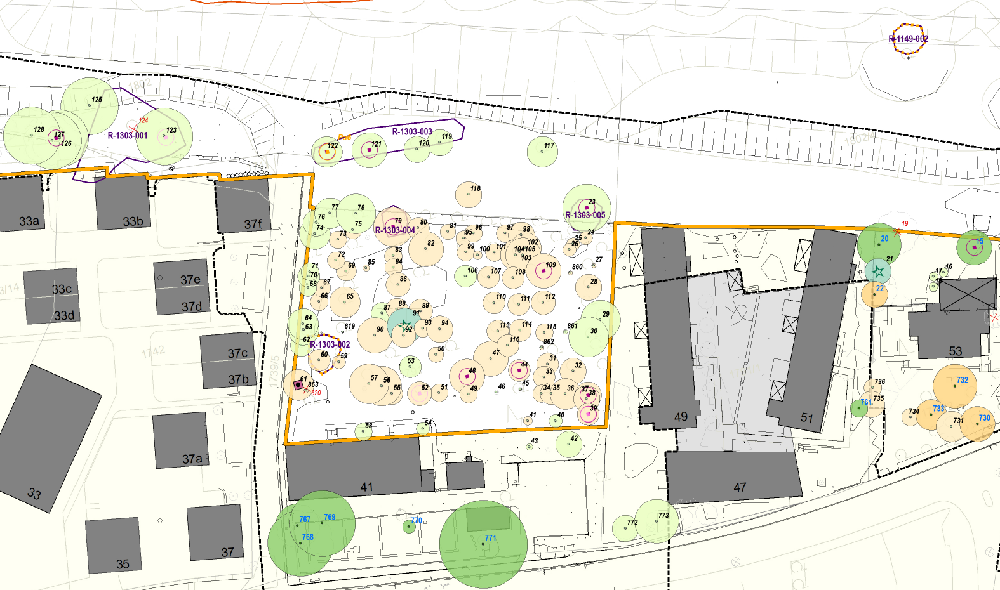

# Zweite Ergänzung unserer Einwendung – Geltungsbereich der Baumschutzverordnung auf dem Grundstück Wöhrdstraße 41

 

Martin Schwenzer · Stephanie Sabatier 
Wöhrdstraße 41 · 93059 Regensburg

Stadt Regensburg 
Umweltamt – Planfeststellungsbehörde 
z. Hd. Frau Barbara Wittmann 
Bruderwöhrdstraße 15 b 
93055 Regensburg

**1. Oktober 2026**

---

## Zweite Ergänzung unserer Einwendung im wasserrechtlichen Planfeststellungsverfahren gem. § 68 Abs. 1 i. V. m. § 67 Abs. 2 WHG – Hochwasserschutz an der Donau im Bereich „Unterer Wöhrd", Stadt Regensburg – Abschnitt H

**(AZ.: 31.1.2. Pl-HWS-H/Unterer Wöhrd)**

**Bezug:** Unsere fristgerechte Einwendung vom 14.01.2026 (insbesondere Abschnitte 2.2, 4.4 und 4.10); Erörterungstermin vom 22.07.2026 mit unseren Anträgen 10, 11 und 12 zur Niederschrift; unsere Ergänzung vom 02.08.2026 (übermittelt am 06.08.2026); Vor-Ort-Besprechung mit dem Wasserwirtschaftsamt am 24.06.2026

---

 

Sehr geehrte Frau Wittmann,
sehr geehrte Damen und Herren,

wir ergänzen unsere Einwendung ein zweites Mal um eine Tatsache, die uns erst am 29.09.2026 bekannt geworden ist. Die Regierung der Oberpfalz hat auf Antrag des Einwenders Nils Deichner nach Art. 3 BayUIG die **Stellungnahme des Umweltamts der Stadt Regensburg vom 11.09.2026 (Az. 31.2 Pö / HWS H Baumschutz)** zur Abgrenzung des Geltungsbereichs der Baumschutzverordnung im Vorhabensbereich herausgegeben, mit der **Telefonnotiz vom 25.04.2023** als Anlage (**Anlage 1**). Aus beiden Dokumenten ergibt sich erstmals, wie die Grenze des Baumschutzes auf unserem Grundstück zustande gekommen ist und wo sie verläuft. Der Gegenstand ist umweltbezogen und unterliegt nach der Bekanntmachung vom 17.10.2025 nicht der Präklusion; für die Umweltverträglichkeitsprüfung gilt das Aktualitätsgebot des § 25 Abs. 3 UVPG.

---

## 1. Neue Tatsache: Wie die Grenze des Baumschutzes auf unserem Grundstück gezogen wurde

**a) Die Grenze wurde von der Landschaftsarchitektin des Vorhabensträgers gezeichnet.** Die Baumschutzverordnung der Stadt Regensburg in der Fassung vom 09.01.2023 (nachfolgend „BSchV") gilt für Bäume „innerhalb der im Zusammenhang bebauten Ortsteile" (§ 1 Abs. 1). Für das Vorhaben wurde dieser Geltungsbereich projektbezogen als Linie festgelegt. Die Telefonnotiz des Planungsbüros bgmr Landschaftsarchitekten vom 25.04.2023 hält dazu fest: „Da die neuen Grenzen nicht zeichnerisch definiert sind (**müssten Bauordnung und UA festlegen**), haben Frau Dr. Pöhler und Frau Hain diese telefonisch abgestimmt" und: „**Frau Hain zeichnet die Grenze** nach telefonischer Absprache und stuft die Bäume des Baumkatasters neu nach BaumSchVO ein." Die Legende des Baumkataster-Plans (Anlage D 7.1 der Planunterlagen) bezeichnet die Linie dementsprechend als „digitalisierter **Abgrenzungsvorschlag** nach telefonischer Abstimmung im Umweltamt der Stadt Regensburg am 25.04.2023". Die Planerin des Antragstellers hat damit die Grenze desjenigen Schutzregimes gezeichnet, dem der eigene Antrag unterliegt.

**b) Die fachlich zuständige Stelle hat nicht entschieden.** Die Abgrenzung des im Zusammenhang bebauten Ortsteils ist eine bauplanungsrechtliche Frage (§ 34 BauGB). Die Stellungnahme vom 11.09.2026 räumt ein, dass das Bauordnungsamt und das Stadtplanungsamt nicht entschieden haben: „Im Planungsprozess wurde die Grenzziehung mit den genannten Ämtern diskutiert, die Entscheidung oblag dem Umweltamt." Eine schriftliche, abschnitts- oder standortbezogene Begründung hält das Umweltamt nicht für erforderlich (Antwort 8: „Nein"), eine Überarbeitung von Baumkataster und Umweltunterlagen ebenfalls nicht (Antwort 9: „Nein"), Auswirkungen auf das Planfeststellungsverfahren sieht es keine (Antwort 10: „Keine"). Dasselbe Bauordnungsamt hatte im Änderungsverfahren der Verordnung 2022 selbst zu Protokoll gegeben, es „zweifelt, ob ‚dynamischer' Geltungsbereich, ohne Karte, rechtssicher ist" (Anlage 1 zur Beschlussvorlage VO/22/19666/31 vom 14.11.2022, **Anlage 2**). Außer der Telefonnotiz des Planungsbüros gibt es nach der Stellungnahme kein Dokument der Stadt zur Grenzziehung; die „Abstimmungen vor Ort und per E-Mail und Besprechungen", die der Telefonabstimmung vorausgegangen sein sollen, werden weder datiert noch vorgelegt.

**c) Auf unserem Grundstück ist die Grenze des Baumschutzes identisch mit der geplanten Hochwasserschutzmauer.** Die Telefonnotiz nimmt vom Innenbereich ausdrücklich den „Obstgarten Wöhrdstr. 41 entlang der nördlichen Hausgrenze" aus. Der Erläuterungsbericht (Anlage A, S. 55) legt die Mauer „in Achse der Nordfassade des Gebäudes". Im Baumkataster-Plan D 7.1 verläuft die Linie des Geltungsbereichs bei den Nachbargrundstücken Wöhrdstraße 33a–37f und 49–53 an der nördlichen Grenze der Hausgärten; nur um unseren Garten macht sie eine rechteckige Ausbuchtung nach Süden bis an die Nordwand des Hauses (Abbildung 1). Alles nördlich der Mauerachse, also genau das Baufeld für Mauer, Bohrebene und Untergrundabdichtung, liegt damit außerhalb der Baumschutzverordnung. Sämtliche 90 Bäume des Katasters auf unserem Grundstück (Nr. 24–116) tragen den Schutzstatus „nein" (Anlage D 7.2).

<figure style="margin: 1em 0;">

<figcaption style="font-size: 10pt; margin-top: 4px;"><strong>Abbildung 1:</strong> Ausschnitt aus Anlage D 7.1 (Baumkataster-Plan). Orange: „Geltungsbereich Baumschutzverordnung Regensburg 2023 im Vorhabensbereich". Bei den Nachbargrundstücken verläuft die Linie an der Nordgrenze der Gärten, um den Obstgarten Wöhrdstraße 41 springt sie bis an die Nordfassade des Hauses zurück.</figcaption>
</figure>

**d) Das erklärt den Befund unserer Einwendung 2.2.** Wir hatten gerügt, dass alle Bäume auf unserem Grundstück als „nicht geschützt" geführt werden, obwohl viele von ihnen den Stammumfang von 100 cm überschreiten. Die Ursache ist nach den jetzt vorliegenden Unterlagen kein Mess- oder Übertragungsfehler, sondern die beschriebene Grenzziehung. Unsere Rüge trifft damit nicht einzelne Katasterwerte, sondern die Tatsachengrundlage der gesamten Bewertung auf dem Grundstück.

---

## 2. Was die Grenzziehung für unser Grundstück bewirkt

**a) Ersatzpflanzungen nach der Baumschutzverordnung: null statt mindestens dreizehn.** Auf unserem Grundstück sind nach dem Landschaftspflegerischen Begleitplan (nachfolgend „LBP", Anlage D 2.5, Tab. 5b und 5e) 23 Bäume zu fällen, 21 davon in der „Streuobstwiese Außenbereich". Verlust und Ersatzbedarf nach Baumschutzverordnung sind dafür jeweils mit **0** angesetzt. Nach den eigenen Katasterwerten (Anlage D 7.2) liegen fünf dieser Bäume über der Schutzschwelle des § 1 Abs. 2 BSchV: Stieleiche Nr. 29 (130 cm), Walnuss Nr. 30 (175 cm), Zwetschge Nr. 37 (115 cm, Höhlenbaum), Kultur-Birne Nr. 52 (120 cm, Initialhöhle) und Mirabelle Nr. 61 (mehrstämmig 70 + 65 cm). Lägen sie im Geltungsbereich, ergäbe die Staffel des § 7 Abs. 2 Buchst. a BSchV **13 Ersatzbäume**; mit dem Kultur-Apfel Nr. 39 (Mulmhöhle) und der Sommerlinde Nr. 42, die nach unserer Messung ebenfalls über 100 cm liegen (Einwendung 2.2), wären es 17. Stattdessen werden die 23 Fällungen über die Flächenbewertung nach der Bayerischen Kompensationsverordnung abgegolten und mit 21 Neupflanzungen „Wiederherstellung" verrechnet, davon 19 Bäume II. Wuchsordnung, ohne Einzelbaumbewertung der Eiche und der Walnuss.

**b) Die Alternativenprüfung je Baum entfällt.** Für geschützte Bäume darf eine Genehmigung nach § 5 Nr. 1 BSchV nur erteilt werden, wenn das Vorhaben ohne die Entfernung „nicht möglich ist und **zumutbare Alternativen nicht zur Verfügung stehen**". Im Planfeststellungsverfahren wird diese Genehmigung durch den Planfeststellungsbeschluss ersetzt; „sie darf nur erteilt werden, wenn die Voraussetzungen des § 5 vorliegen" (§ 6 Abs. 3 BSchV, Art. 75 Abs. 1 Satz 1 BayVwVfG). Für Bäume im Geltungsbereich muss die Planfeststellungsbehörde also für jeden einzelnen Baum prüfen, ob eine zumutbare Umplanung möglich ist. Genau diese Prüfung haben wir mit Antrag 12 (Vorverlegung des Endpunkts der Untergrundabdichtung) und in der Vor-Ort-Besprechung vom 24.06.2026 verlangt (**Anlage 3**, Abschnitt B). Mit der Grenzziehung entlang der Mauerachse ist sie für die Bäume, die der Mauer weichen sollen, von vornherein ausgeschlossen.

**c) Die Planunterlagen behandeln den Obstgarten je nach Argumentationsbedarf unterschiedlich.** Der LBP führt die Einstufung des Obstgartens als Außenbereich als **Vorteil** der Vorzugsvariante an („Erhalt/langfristige Sicherung der Streuobstwiese als Teil des städtebaulichen Außenbereichs", Anlage D 2.0, S. 57) und verwirft die Variante einer Mauer an der nördlichen Grundstücksgrenze unter anderem deshalb, weil der Obstgarten dann „Teil des Siedlungsbereichs" würde. Dieselbe Einstufung nimmt zugleich den Bäumen, die für diese Vorzugsvariante gefällt werden, den Schutz. Die Umweltverträglichkeitsstudie wiederum hält eine „Siedlungsentwicklung im Obstgartenareal (PA 1) gemäß Flächennutzungsplan" für nicht ausgeschlossen (Anlage D 1.0). Der LBP selbst beschreibt den Bestand als „Streuobstwiesen mit **Hausgartennutzung**" (Anlage D 2.0), die Biotopkartierung als „strukturreichen Garten", „Nutz- und Ziergarten" (Anlage D 6.0, S. 6 f.). Hausnahe, eingefriedete und vom Wohnhaus aus genutzte Gartenflächen gehören nach ständiger Rechtsprechung regelmäßig noch zum Bebauungszusammenhang. Die gezogene Linie lässt nicht einmal den hausnahen Streifen im Innenbereich, in dem die Mauer stehen soll.

**d) Die behauptete Ortseinsicht ist nicht belegt.** Nach der Stellungnahme wurden die tatsächlichen Verhältnisse „in uneindeutigen Fällen" geprüft, „sowohl hinsichtlich der Aktenlage als auch durch konkrete Ortseinsichten (z. B. ‚Jacobi-Areal' oder Grundstück Wöhrdstraße 41)" (Antwort 4). Datum, Teilnehmer und Vermerk werden nicht genannt. Den Bewohnerinnen und Bewohnern des Anwesens ist eine Ortseinsicht des Umweltamts zur Grenze des Baumschutzes nicht bekannt; eine Anfrage hierzu hat es nicht gegeben. Das Umweltamt stuft den Fall damit selbst als „uneindeutig" ein, ohne die Prüfung zu dokumentieren.

---

## 3. Weitere Widersprüche in der Anwendung der Grenze

Der Einwender Nils Deichner hat der Regierung der Oberpfalz mit Schreiben vom 30.09.2026 im Einzelnen dargelegt, dass die Stellungnahme vom 11.09.2026 in mehreren Punkten nicht mit den ausgelegten Planunterlagen übereinstimmt. Wir schließen uns dem an und heben hervor, was unser Grundstück unmittelbar betrifft:

**a) Hochufer ist nicht gleich Hochufer.** Die Telefonnotiz ordnet das „Hochufer Kastanienallee" (PA 5) dem Innenbereich zu, das Hochufer in PA 1 „nördlich der Bau- und Gartengrenze", also vor unserem Grundstück und den Nachbargrundstücken, dagegen dem Außenbereich. Ein Kriterium für diese unterschiedliche Behandlung nennen weder die Planunterlagen noch die Stellungnahme (Antwort 6: „einheitlich und widerspruchsfrei … Ja").

**b) Die Linie gilt starr, wo sie Schutz nimmt, und elastisch, wo Ersatz angerechnet wird.** Die positive Bilanz nach Baumschutzverordnung von 24 Bäumen I. Wuchsordnung (Anlage D 2.0, S. 69) kommt nach Tab. 5e nur durch die Anrechnung von 32 Neupflanzungen I. Wuchsordnung in PA 10 zustande. PA 10 ist nach der Telefonnotiz Außenbereich. § 7 Abs. 2 BSchV verlangt Ersatz „auf einem Grundstück im Geltungsbereich dieser Verordnung". Ohne PA 10 ergäbe sich ein Defizit von 8 Bäumen I. Wuchsordnung. Zugleich wurden Neupflanzungen „nach Rücksprache im Umweltamt" auch dann als geschützte Ersatzpflanzungen eingestuft, „wenn diese sich außerhalb der im Zusammenhang bebauten Ortsteile befinden" (Anlage D 7.0, S. 4).

**c) Die Katasterwerte in Grenznähe sind nicht belastbar.** Unmittelbar westlich unseres Grundstücks, auf dem Hochufer vor den Häusern Wöhrdstraße 33a/33b, sollen vier Altbäume des Stadtbiotops R-1303-001 baubedingt gefällt werden (Anlage A, S. 80; Anlage D 2.0, S. 66). Das Kataster führt sie als „nicht geschützt" mit Stammumfängen von 300 cm (Spitzahorn Nr. 123), 100 cm (Robinie Nr. 126), 400 cm (Robinie Nr. 127) und 300 cm (Robinie Nr. 128), jeweils mit dem Vermerk „V-Daten angepasst" und mit identischer Höhe (13 m) und Kronenbreite (6,5 m). Eine Nachmessung am 01.10.2026 in 1 m Höhe ergab näherungsweise mehr als 300 cm, etwa 200 cm, etwas mehr als 100 cm und etwa 240 cm. Die Werte des Katasters sind dort offenkundig Schätzwerte. Das bestätigt unseren Antrag 10 (Neubegehung und Korrektur des Baumkatasters) und die Kataster-Rüge der Einwendung Gebauer. Baumkataster-Erläuterung D 7.0 (S. 5) hält im Übrigen selbst fest: „Je nach Verfahrensdauer kann damit ggf. eine erneute Prüfung des Schutzstatus von Bäumen im Eingriffsbereich notwendig werden."

**d) Technische Alternativen zum Baumerhalt gibt es.** Nach unserer Kenntnis stellen Vorhabensträger und Objektplanung für die genannten vier Altbäume vor Wöhrdstraße 33a/33b den Einsatz eines anderen, aufwendigeren Bohrgeräts für die Untergrundabdichtung in Aussicht, um die Bäume erhalten zu können. Wir begrüßen das ausdrücklich. Wenn eine solche Bauweise für vier nach den Planunterlagen ungeschützte Bäume am Ufer in Betracht kommt, ist sie für die Bäume auf Wöhrdstraße 41 erst recht eine „zumutbare Alternative" im Sinne des § 5 Nr. 1 BSchV. Wir bitten um Bestätigung, dass diese Bauweise geprüft wird, und um ihre Prüfung auch für unser Grundstück.

---

## 4. Anträge

Wir beantragen zur Sachverhaltsaufklärung (Art. 24 BayVwVfG) und ergänzend zu unseren Anträgen 10, 11 und 12 vom 22.07.2026:

1. **Förmliche Feststellung des Geltungsbereichs.** Die Stadt Regensburg stellt den räumlichen Geltungsbereich der Baumschutzverordnung im Vorhabensbereich unter Beteiligung des Bauordnungsamts schriftlich und mit Karte fest und begründet ihn abschnittsweise. Für das Grundstück Wöhrdstraße 41 ist standortbezogen darzulegen, warum der Bebauungszusammenhang an der Nordfassade des Wohnhauses enden soll, obwohl hausnahe, eingefriedete und bewirtschaftete Gartenflächen vorliegen und die Linie bei den Nachbargrundstücken an der Nordgrenze der Gärten verläuft; ferner, nach welchem Kriterium das Hochufer an der Kastanienallee dem Innenbereich, das Hochufer in PA 1 dem Außenbereich zugeordnet wurde.
2. **Vorlage der Unterlagen zur Grenzziehung.** Vorzulegen sind die der Telefonabstimmung vom 25.04.2023 vorausgegangenen Abstimmungen, E-Mails, Besprechungsvermerke und Kartenentwürfe sowie der Nachweis der in der Stellungnahme behaupteten Ortseinsicht auf dem Grundstück Wöhrdstraße 41 (Datum, Teilnehmer, Vermerk).
3. **Vorlage der früheren Geltungsbereichskarte.** Vorzulegen ist die Karte zur Baumschutzverordnung in der Fassung von 1993/2004 mit einer Darstellung, welche Bäume des Vorhabens nach der früheren Fassung geschützt waren.
4. **Neuberechnung der Bilanz nach Baumschutzverordnung** (Anlage D 2.5, Tab. 5e): unter Einbeziehung der Bäume des Grundstücks Wöhrdstraße 41, ohne Anrechnung von Ersatzpflanzungen außerhalb des Geltungsbereichs (PA 10) und mit Einzelbaumbewertung der Stieleiche Nr. 29 und der Walnuss Nr. 30.
5. **Prüfung der Genehmigungsvoraussetzungen des § 5 BSchV für jeden betroffenen Baum** auf dem Grundstück Wöhrdstraße 41, einschließlich der Alternativen eines früheren Endes der Untergrundabdichtung (Antrag 12; Anlage 3, Abschnitt B) und des unter 3 d genannten Bohrverfahrens, sowie Vorlage einer aktualisierten Fällliste für die am 24.06.2026 zugesagte geänderte Linienführung (Anlage 3, Abschnitt A, Nr. 1 und 4).
6. **Klarstellung im Planfeststellungsbeschluss**, für welche Bäume er die Genehmigung nach der Baumschutzverordnung ersetzt (§ 6 Abs. 3 BSchV, Art. 75 Abs. 1 BayVwVfG), nach der Sach- und Rechtslage im Zeitpunkt seines Erlasses.
7. **Eigenständige Prüfung durch die Planfeststellungsbehörde.** Die Grenzfrage ist von der Planfeststellungsbehörde selbst zu prüfen und zu entscheiden. Die Stellungnahme vom 11.09.2026 stammt von derselben Behörde, beantwortet die Frage nach den Auswirkungen auf das Planfeststellungsverfahren mit „Keine" und verweist bei der Frage nach irreversiblen Maßnahmen darauf, nicht Vorhabenträger zu sein. Planfeststellungsbehörde ist nach der Bekanntmachung vom 17.10.2025 das Umweltamt. Wir bitten um Bestätigung, dass die Vorabstimmung zwischen Amt 31.2 und dem Vorhabensträger die Entscheidung der Planfeststellungsbehörde nicht vorwegnimmt.

---

## 5. Verfahrensbitten

1. Wir bitten um **Eingangsbestätigung** für diese Ergänzung und, da sie bislang aussteht, auch für unsere Ergänzung vom 02.08.2026 (übermittelt am 06.08.2026 mit fünf Anlagen; Nachfrage vom 06.09.2026).
2. Wir bitten, diese Ergänzung in die zusammenfassende Darstellung nach § 24 UVPG und in die Abwägung einzubeziehen und uns das Ergebnis der unter 4 beantragten Feststellung vor der Entscheidung mitzuteilen.
3. Wir bitten, uns entsprechend unserem Antrag 15 über den weiteren Verfahrensgang individuell zu informieren und die Entscheidung individuell zuzustellen.

Für Rückfragen und für einen gemeinsamen Ortstermin auf dem Grundstück stehen wir jederzeit zur Verfügung.

 

Mit freundlichen Grüßen

   

Martin Schwenzer &nbsp;&nbsp;&nbsp;&nbsp;&nbsp;&nbsp;&nbsp;&nbsp; Stephanie Sabatier

Wöhrdstraße 41, 93059 Regensburg

## Anlagen

1. Stellungnahme des Umweltamts der Stadt Regensburg (Amt 31.2) vom 11.09.2026 an die Regierung der Oberpfalz, SG 55.1, Az. 31.2 Pö / HWS H Baumschutz, mit Anlage: Telefonnotiz bgmr Landschaftsarchitekten vom 25.04.2023 (6 Seiten)
2. Anlage 1 zur Beschlussvorlage VO/22/19666/31 vom 14.11.2022, „Stellungnahmen" zur Änderung der Baumschutzverordnung (Stellungnahme des Bauordnungsamts, 4 Seiten)
3. Ergebnisprotokoll der Vor-Ort-Besprechung vom 24.06.2026 auf dem Grundstück Wöhrdstraße 41 (Stand 28.07.2026, dem Wasserwirtschaftsamt am 31.07.2026 zur Bestätigung übermittelt)

Abbildung 1 im Text: Ausschnitt aus Anlage D 7.1 der Planunterlagen (Baumkataster-Plan, Geltungsbereich Baumschutzverordnung 2023).
